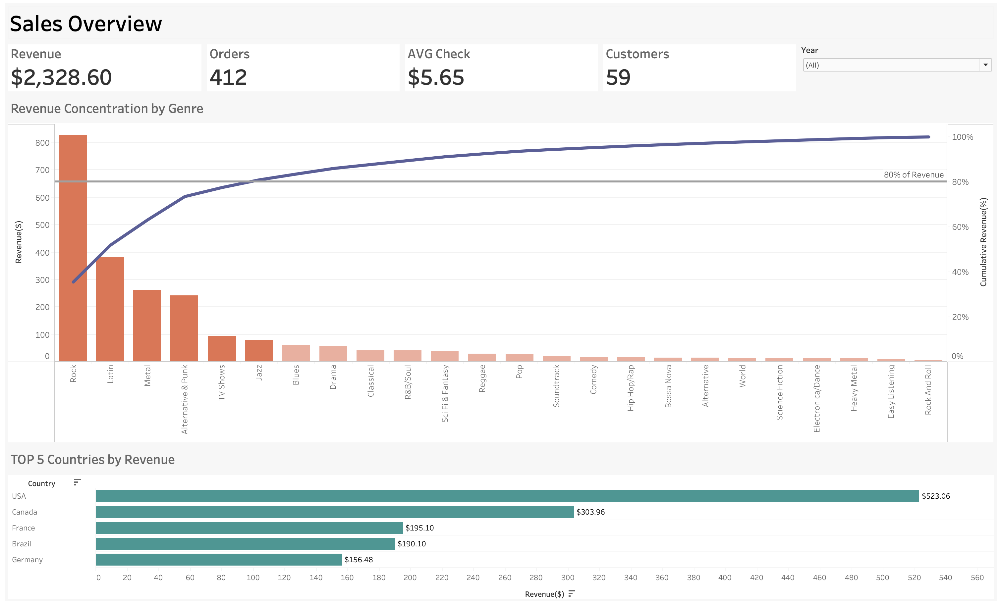
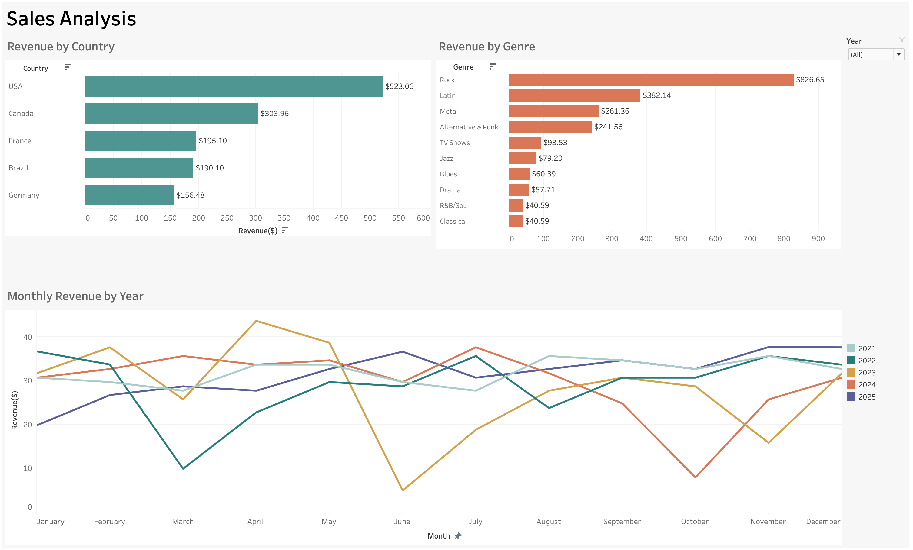

# 🎵 Music Store Business Analytics

## Project Overview

This project presents an end-to-end sales analysis of the Chinook digital music store using SQL and Tableau.

The goal of the project is to transform transactional sales data into actionable business insights and demonstrate a complete data analytics workflow — from defining business questions and preparing data to validating metrics and building interactive dashboards.

The analysis covers sales transactions from **2021 to 2025**.

The analysis focuses on:

* overall sales performance;
* revenue distribution by genre;
* geographic revenue performance;
* customer contribution to revenue;
* revenue per customer;
* monthly revenue dynamics across years.

## Business Problem

The management of a digital music store wants to understand what drives revenue and where the business performs best.

The company has detailed transactional data, but raw transaction records do not directly answer important business questions.

The analysis therefore focuses on identifying the main revenue drivers, understanding geographic differences in customer value, and examining how sales change over time.

## Business Questions

### 📈 Sales Performance

* How is the business performing overall?
* What are the key sales KPIs?
* How much revenue does the business generate?
* How does revenue change over 2021–2025?
* How many orders and customers does it have?
* What is the Average Order Value?

### 🎵 Product / Genre Analysis

* Which genres generate the highest revenue?
* How concentrated is revenue across genres?
* Which genres account for approximately 80% of total revenue?

### 🌍 Geographic Analysis

* Which countries generate the most revenue?
* How does revenue differ from customer count across countries?
* Which countries generate higher revenue per customer?

### 📅 Time Analysis

* How does monthly revenue change across 2021–2025?
* Are there recurring monthly patterns?
* How does revenue performance differ between years?

## Dataset

The project uses the **Chinook sample digital music store database**.

**Analysis period:** 2021–2025.

The source data contains information about customers, invoices, invoice items, tracks, albums, artists, genres and employees.

For Tableau analysis, the relational data was transformed into an analytical **Fact_Sales** dataset.

### Fact_Sales

The final analytical dataset contains transaction-level sales data combining information about transactions, customers, products, genres, dates and revenue.

| Field | Description |
|---|---|
| Date | Invoice date |
| InvoiceId | Order identifier |
| InvoiceLineId | Order line identifier |
| TrackId | Track identifier |
| Track | Track name |
| UnitPrice | Price per track |
| Quantity | Quantity purchased |
| Revenue | Revenue generated by the transaction line |
| Genre | Music genre |
| CustomerId | Customer identifier |
| Customer | Customer name |
| Country | Customer country |
| EmployeeId | Support representative identifier |
| EmployeeName | Support representative |

The dataset contains:

* **2,240 transaction lines**
* **412 orders**
* **59 customers**

## Tools

* **SQL (MySQL)** — data extraction, transformation, validation and analysis
* **Tableau Public** — interactive dashboards and data visualization
* **Excel - analytical dataset preparation
* **Git & GitHub** — version control and project presentation

## Skills Demonstrated

* SQL querying
* JOINs and relational data analysis
* Aggregation and KPI calculation
* Data validation
* Calculated fields
* Pareto analysis
* Customer and geographic analysis
* Revenue analysis
* Tableau dashboard development
* Data visualization
* Business insight generation
* Data storytelling

## Analysis Workflow

```text
Business Questions
       ↓
Data Preparation in SQL
       ↓
Fact_Sales Dataset
       ↓
Metric Validation
       ↓
Tableau Dashboards
       ↓
Analysis & Insights
       ↓
Business Recommendations
```

## Data Preparation

The original Chinook relational database was transformed into an analytical dataset using SQL.

The main transformation combines transaction, customer, product, genre and employee information into a single **Fact_Sales** dataset suitable for analysis and visualization.

The core revenue calculation is:

**Revenue = UnitPrice × Quantity**

The Fact_Sales dataset was created using a SQL query, exported as a CSV file, and then used as the data source for Tableau Public.

The complete SQL query used to create the Fact_Sales dataset is available in [`sql/fact_sales.sql`](sql/fact_sales.sql).

## Dashboards

### 1. Executive Dashboard — Sales Overview

The Executive Dashboard provides a high-level overview of business performance.
[View on Tableau Public](https://public.tableau.com/app/profile/ludmila.kuznetsova/viz/ChinookAnalysis_SalesOverview/ChinookAnalysis)

#### Key KPIs

* **Revenue:** $2,328.60
* **Orders:** 412
* **Customers:** 59
* **Average Order Value:** $5.65

#### Visualizations

* Revenue / business KPI overview
* Revenue Concentration by Genre — Pareto analysis
* Top 5 Countries by Revenue
* Year filter



### 2. Analytical Dashboard — Sales Analysis

The Analytical Dashboard provides a more detailed view of the main revenue drivers.
[View on Tableau Public](https://public.tableau.com/app/profile/ludmila.kuznetsova/viz/ChinookAnalysis_SalesAnalysis/SalesAnalysis)

#### Visualizations

* Top 5 Countries by Revenue
* Top 10 Genres by Revenue
* Monthly Revenue by Year
* Customer Count and Revenue per Customer by Country

The dashboard allows users to investigate where revenue comes from and how revenue patterns differ across countries, genres and years.



## Key Insights

### 1. The business showed no meaningful revenue growth from 2021 to 2025

Total revenue across the five-year period was **$2,328.60**.

Annual revenue remained within a relatively narrow range, from **$449.46 in 2021** to **$481.45 in 2022**.

| Year | Revenue | Orders | Customers | AOV |
|---|---:|---:|---:|---:|
| 2021 | $449.46 | 83 | 46 | $5.42 |
| 2022 | $481.45 | 83 | 46 | $5.80 |
| 2023 | $469.58 | 83 | 47 | $5.66 |
| 2024 | $477.53 | 83 | 47 | $5.75 |
| 2025 | $450.58 | 80 | 46 | $5.63 |

Revenue then remained relatively stable before declining to **$450.58 in 2025**.

Overall, 2025 revenue was only **0.25% higher than in 2021**, indicating that the business experienced no meaningful long-term revenue growth during the analyzed period.

### 2. A stable customer base and order volume explain the lack of revenue growth in 2021–2025

The number of customers remained highly stable throughout 2021–2025, ranging from **46 to 47 customers per year**.

Order volume was also stable at **83 orders per year from 2021 to 2024**, before declining slightly to **80 orders in 2025**.

With both customer and order volumes remaining largely unchanged, Average Order Value was the main source of year-to-year revenue fluctuations. AOV ranged from **$5.42 to $5.80** during the period.

This suggests that the main growth limitation was not a significant decline in customer value or order volume, but the absence of meaningful growth in the customer base and purchasing activity.

### 3. Revenue was highly concentrated across genres in 2021–2025

The top six genres accounted for approximately **80.9% of total revenue** across 2021–2025.

Rock was the dominant genre, generating **$826.65**, or approximately **35.5% of total revenue** on its own.

The next largest contributors were:

* **Latin — $382.14**
* **Metal — $261.36**
* **Alternative & Punk — $241.56**

This indicates a strong concentration of revenue in a relatively small number of genres.

### 4. Revenue was geographically concentrated between 2021 and 2025

Across 2021–2025, the top five countries generated **$1,368.70**, representing approximately **58.8% of total revenue**.

The USA was the largest market:

* **USA:** $523.06
* **Canada:** $303.96
* **France:** $195.10
* **Brazil:** $190.10
* **Germany:** $156.48

The USA alone contributed approximately **22.5% of total revenue**.

### 5. Revenue per customer remained relatively consistent across the largest markets in 2021–2025

Across 2021–2025, the largest markets by total revenue also showed relatively similar Revenue per Customer.

| Country | Revenue | Customers | Revenue per Customer |
|---|---:|---:|---:|
| USA | $523.06 | 13 | $40.24 |
| Canada | $303.96 | 8 | $37.99 |
| France | $195.10 | 5 | $39.02 |
| Brazil | $190.10 | 5 | $38.02 |
| Germany | $156.48 | 4 | $39.12 |

This suggests that differences in total country revenue were driven primarily by the size of the customer base rather than major differences in customer value.

### 6. Monthly revenue showed no strong recurring seasonal pattern between 2021 and 2025

The monthly analysis across 2021–2025 showed a relatively stable baseline of monthly revenue, with several temporary peaks and declines rather than a strong recurring seasonal pattern.

The most noticeable deviations occurred in individual months, particularly in 2022–2024, while 2025 remained close to the overall monthly baseline.

This suggests that the dataset does not show strong, consistent seasonality, although individual monthly fluctuations were present.

## Business Recommendations

### 1. Focus on customer base expansion

The main growth constraint is the lack of meaningful customer growth. With the customer base remaining at 46–47 customers per year, acquiring new customers should be a primary growth priority.

### 2. Increase customer purchasing activity and Average Order Value

Since order volume and AOV remained relatively stable, increasing purchase frequency and encouraging higher-value purchases could provide additional revenue growth without relying solely on customer acquisition.

### 3. Prioritize high-performing genres and markets while diversifying revenue

Rock and the top six genres generated a large share of total revenue, while the USA and other leading markets accounted for a significant portion of geographic revenue.

These segments should remain a focus for commercial activity, while developing secondary genres and markets can reduce concentration risk and create additional growth opportunities.

### 4. Use targeted campaigns rather than relying on seasonality

The analysis did not reveal a strong recurring seasonal pattern.

Marketing activity should therefore be driven by customer, genre and market performance rather than broad seasonal assumptions. Short-term peaks can still be used to identify opportunities for targeted campaigns.

## Conclusion

The analysis shows that the business maintained a relatively stable revenue level between 2021 and 2025, with no meaningful long-term growth. Customer and order volumes remained largely unchanged, while Average Order Value fluctuated only slightly.

Revenue was concentrated across a small number of genres and countries, with Rock and the USA being the largest contributors. At the same time, Revenue per Customer remained relatively consistent across major markets, suggesting that differences in country performance were driven primarily by customer base size.

Overall, the key growth opportunity is to expand the customer base and increase purchasing activity while continuing to leverage high-performing genres and markets. At the same time, developing secondary genres and markets could help reduce revenue concentration and create a more diversified growth base.

This analysis demonstrates how customer, revenue, genre, geographic and temporal data can be combined to identify the key factors limiting growth and inform targeted business decisions.
